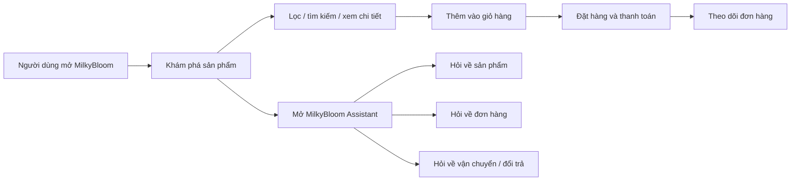
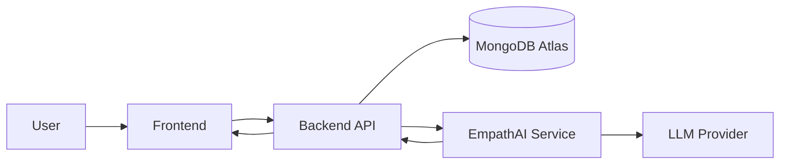

# MilkyBloom x EmpathAI

<p align="center">
  
</p>

<p align="center">
  <a href="https://milkybloom-frontend.onrender.com/"></a>
  
  
  
  
</p>

<p align="center">
  <strong>MilkyBloom</strong> là một trải nghiệm thương mại điện tử full-stack cho dòng sản phẩm sưu tầm, kết hợp storefront hiện đại với
  <strong>EmpathAI</strong> - lớp trợ lý AI hỗ trợ khách hàng theo cách tự nhiên, có ngữ cảnh và giàu tính đồng cảm.
</p>

<p align="center">
  Người xem có thể hiểu dự án như một sản phẩm hoàn chỉnh:
  <strong>xem sản phẩm</strong>, <strong>lọc và mua hàng</strong>, <strong>theo dõi đơn</strong>, và <strong>trò chuyện với AI support</strong>
  mà không cần đọc code trước.
</p>

---

## Mục lục

- [Demo nhanh](#demo-nhanh)
- [Dự án này làm gì](#dự-án-này-làm-gì)
- [Điểm nổi bật](#điểm-nổi-bật)
- [Hình ảnh dự án](#hình-ảnh-dự-án)
- [Luồng trải nghiệm người dùng](#luồng-trải-nghiệm-người-dùng)
- [Kiến trúc tổng thể](#kiến-trúc-tổng-thể)
- [Công nghệ chính](#công-nghệ-chính)
- [Cấu trúc repository](#cấu-trúc-repository)
- [Chạy dự án local](#chạy-dự-án-local)
- [Tài liệu liên quan](#tài-liệu-liên-quan)
- [Thành viên](#thành-viên)

## Demo nhanh

### Mở ngay bản production

- Storefront: [https://milkybloom-frontend.onrender.com/](https://milkybloom-frontend.onrender.com/)
- Repo: [https://github.com/QuangVoAI/MilkyBloomVibeCode](https://github.com/QuangVoAI/MilkyBloomVibeCode)

### QR mở nhanh trên điện thoại

<p align="center">
  <a href="https://milkybloom-frontend.onrender.com/" target="_blank" rel="noreferrer">
    
  </a>
</p>

### Nên xem gì đầu tiên

1. Mở `Home` để xem giao diện tổng thể và tinh thần thương hiệu.
2. Vào `Shop` để xem danh mục sản phẩm, filter, sort và product cards.
3. Mở `MilkyBloom Assistant` để hỏi về sản phẩm, đơn hàng, đổi trả hoặc vận chuyển.
4. Đăng ký hoặc đăng nhập để test giỏ hàng, checkout và `Order History`.
5. Nếu muốn xem phần quản trị, vào `Admin` để thấy dashboard, users, products, orders và discount codes.

## Dự án này làm gì

MilkyBloom được thiết kế như một storefront nhẹ nhàng, dễ dùng và có cảm giác hiện đại trên cả desktop lẫn mobile. Phần AI không chỉ là chatbot trả lời FAQ, mà đóng vai trò như một lớp hỗ trợ khách hàng thông minh:

- hiểu câu hỏi theo ngữ cảnh
- gợi ý sản phẩm phù hợp
- hỗ trợ tra cứu đơn hàng
- giải thích chính sách giao hàng, đổi trả
- phản hồi theo hướng tự nhiên, lịch sự và đồng cảm hơn với người dùng

Nói ngắn gọn, đây là một dự án kết hợp giữa:

- **e-commerce experience**
- **real-time AI support**
- **triển khai full-stack thực tế**

## Điểm nổi bật

| Mảng | Giá trị mang lại |
|---|---|
| Storefront | Giao diện mua sắm rõ ràng, pastel, trực quan và dễ thao tác |
| Catalog | Danh mục sản phẩm, lọc theo nhu cầu, sort và tìm kiếm nhanh |
| Ordering | Giỏ hàng, checkout, order history và theo dõi trạng thái đơn |
| AI Support | Trợ lý AI hỗ trợ sản phẩm, vận chuyển, đổi trả, đơn hàng |
| Empathy Layer | Phản hồi tự nhiên và có tính đồng cảm thay vì chỉ trả lời máy móc |
| Admin | Quản trị sản phẩm, người dùng, đơn hàng, discount codes |
| Media | Ảnh và video phục vụ theo luồng deploy thực tế, không chỉ demo local |

## Hình ảnh dự án

### Poster giới thiệu

<p align="center">
  
</p>

### Toàn cảnh sản phẩm

<p align="center">
  
</p>

### Bạn sẽ thấy trong giao diện

- **Storefront:** home, shop, categories, about, contact
- **Shopping flow:** product detail, add to cart, checkout, order history
- **AI assistant:** popup hỗ trợ realtime ngay trên giao diện mua sắm
- **Admin panel:** quản lý dữ liệu và vận hành hệ thống

## Luồng trải nghiệm người dùng



### Ví dụ các tình huống demo tốt

- `Gợi ý cho tôi món đồ dưới 300k`
- `Tôi muốn một món quà dễ thương cho bạn nữ`
- `Đơn hàng của tôi đang ở đâu`
- `Chính sách đổi trả như thế nào`
- `Có mẫu nào hợp để tặng sinh nhật không`

## Kiến trúc tổng thể

MilkyBloom không chỉ là frontend demo, mà là một hệ thống gồm 3 lớp chạy cùng nhau:



### 1. Frontend

- hiển thị storefront và admin panel
- gọi REST API
- render sản phẩm, đơn hàng, profile, discount codes
- mở chat widget ngay trên giao diện người dùng

### 2. Backend

- xử lý auth, orders, products, categories, users
- quản lý media và dữ liệu nghiệp vụ
- làm cầu nối giữa frontend và EmpathAI

### 3. EmpathAI

- nhận yêu cầu chat
- hiểu ý định người dùng
- tra cứu ngữ cảnh liên quan
- tạo câu trả lời phù hợp
- stream phản hồi về giao diện theo thời gian thực

## Công nghệ chính

| Lớp | Công nghệ |
|---|---|
| Frontend | React, Vite, Tailwind, Radix UI |
| Backend | Node.js, Express |
| Database | MongoDB Atlas, GridFS |
| AI Service | Python, LangGraph |
| Realtime | WebSocket / Socket-based streaming |
| LLM backend | Groq, Featherless-compatible flow |
| Deploy | Render |

## Cấu trúc repository

```text
MilkyBloomVibeCode/
├── frontend/      # Storefront + Admin UI
├── backend/       # REST API, auth, media, order management
├── agentic-ai/    # EmpathAI service and streaming pipeline
├── docs/          # Notes and supporting docs
└── README.md      # Product-facing overview
```

## Chạy dự án local

Mỗi service có file `.env.example` riêng. Copy file mẫu tương ứng và điền biến môi trường cần thiết.

### 1. Frontend

```bash
cd frontend
npm install
npm run dev
```

Frontend mặc định chạy ở `http://localhost:5173`.

### 2. Backend

```bash
cd backend
npm install
npm run dev
```

Backend mặc định chạy ở `http://localhost:6969`.

### 3. EmpathAI WebSocket service

```bash
cd agentic-ai
python ws_server.py
```

Service AI WebSocket mặc định chạy ở `ws://127.0.0.1:8788`.

### 4. Seed demo catalog

```bash
cd backend
npm run seed:catalog
```

Seed script sẽ:

- tạo dữ liệu mẫu
- nạp catalog demo
- upload media cần thiết
- giúp bạn có một bản demo gần với production

## Tài liệu liên quan

- [Frontend README](./frontend/README.md)
- [EmpathAI README](./agentic-ai/README.md)
- [EmpathAI local run guide](./agentic-ai/README.local.md)

## Thành viên

- `523H0173` - Võ Xuân Quang
- `523H0178` - Hoàng Xuân Thành

---

<p align="center">
  <strong>MilkyBloom x EmpathAI</strong><br />
  Một storefront sưu tầm kết hợp AI support đồng cảm, realtime và dễ demo cho người không cần biết code.
</p>
