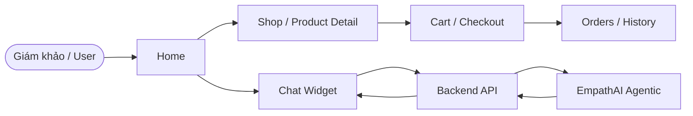
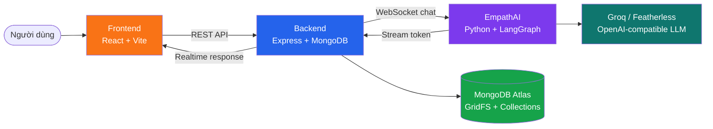
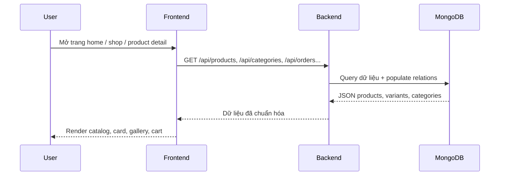
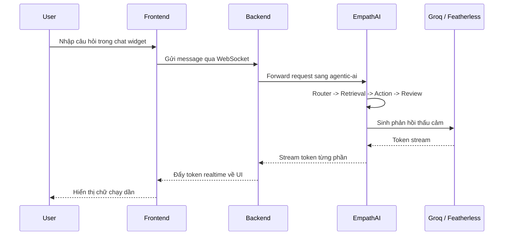
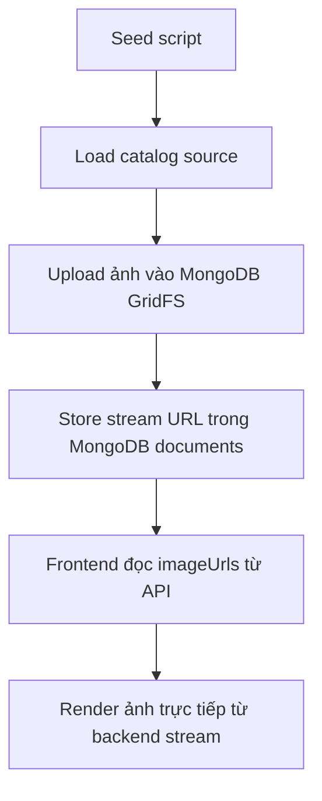

# MilkyBloom x EmpathAI

Mở web demo ngay: https://milkybloom-frontend.onrender.com/

<p align="center">
  
  
  
  
  
</p>

MilkyBloom x EmpathAI là một nền tảng thương mại điện tử đồ chơi trẻ em tích hợp lớp CSKH agentic thời gian thực.

- **MilkyBloom**: storefront e-commerce, product catalog, cart, checkout, orders, profile
- **EmpathAI**: agentic customer service, xử lý hội thoại thấu cảm, tra cứu ngữ cảnh, và thực thi action hỗ trợ khách hàng

Mục tiêu của dự án là giữ trải nghiệm mua sắm mượt cho khách hàng, đồng thời để AI hỗ trợ khách hàng theo cách tự nhiên, có ngữ cảnh, và phản hồi realtime.

## Tài khoản Test

- Nếu bạn đã seed dữ liệu demo, hãy dùng account đó để vào thử toàn bộ flow mua hàng và chat hỗ trợ.
- Nếu chưa có account sẵn, có thể đăng ký mới ngay trên web demo để test phần login, giỏ hàng, đơn hàng, và chat.
- Với vai trò giám khảo, chỉ cần mở web demo ở trên là có thể test ngay mà không cần chạy local.

## What to demo first

- Mở trang Home để xem hero, catalog nổi bật, và layout tổng thể.
- Vào Shop để kiểm tra danh sách sản phẩm, ảnh, video, và filter.
- Thử chat MilkyBloom Assistant bằng câu như `Gợi ý cho tôi món đồ dưới 300k`.
- Đăng nhập hoặc tạo account test, rồi thử thêm giỏ hàng và đặt hàng.
- Nếu cần xem luồng AI, gửi câu hỏi về sản phẩm, đơn hàng, hoặc đổi trả để thấy EmpathAI phản hồi realtime.

## Demo Flow



## Demo Online

Link web production: [https://milkybloom-frontend.onrender.com/](https://milkybloom-frontend.onrender.com/)

Quét QR để mở nhanh trên điện thoại:

<p align="center">
  <a href="https://milkybloom-frontend.onrender.com/" target="_blank" rel="noreferrer">
    
  </a>
</p>

## Project Highlights

- **Streaming-only chat**: UI chat luôn phản hồi theo thời gian thực, không còn chế độ public trả lời cuối
- **Mongo-only media**: ảnh demo và ảnh nghiệp vụ được phục vụ qua MongoDB GridFS, không phụ thuộc local assets
- **Agentic support flow**: EmpathAI có thể hiểu ngữ cảnh, tra cứu, và thực thi hành động hỗ trợ khách hàng
- **Clone-and-run friendly**: seed catalog, env mẫu, và hướng dẫn chạy đã được chuẩn hóa để dễ triển khai lại

## Mục Lục

- [Tổng Quan](#tổng-quan)
- [Tài khoản Test](#tài-khoản-test)
- [What to demo first](#what-to-demo-first)
- [Demo Flow](#demo-flow)
- [Kiến Trúc Hệ Thống](#kiến-trúc-hệ-thống)
- [Luồng Hoạt Động Chi Tiết](#luồng-hoạt-động-chi-tiết)
- [Cấu Trúc Repository](#cấu-trúc-repository)
- [Công Nghệ Chính](#công-nghệ-chính)
- [Chạy Dự Án](#chạy-dự-án)
- [Thành Viên](#thành-viên)

## Tổng Quan

Repository này gồm 3 lớp chính:

- `frontend/` để hiển thị UI cho người dùng và admin
- `backend/` để xử lý API, database, auth, ảnh, đơn hàng, và bridge chat
- `agentic-ai/` để chạy pipeline CSKH agentic riêng, stream phản hồi qua WebSocket

Luồng chat hiện tại là **streaming only**. Người dùng gửi tin nhắn từ frontend, backend chuyển sang EmpathAI, EmpathAI xử lý pipeline agentic, rồi stream token ngược về UI.

## Kiến Trúc Hệ Thống



### Vai trò từng lớp

- **Frontend** là lớp trình bày, gọi API, hiển thị catalog, checkout, profile, và chat support
- **Backend** là trung tâm điều phối, xử lý dữ liệu sản phẩm, đơn hàng, auth, ảnh, và bridge qua EmpathAI
- **EmpathAI** là lớp CSKH agentic, gồm router, retrieval, action execution, reviewer, và writer
- **MongoDB Atlas** lưu toàn bộ dữ liệu nghiệp vụ và ảnh demo qua GridFS
- **Groq** là backend LLM chính cho EmpathAI, **Featherless** là fallback và mode thay thế

## Luồng Hoạt Động Chi Tiết

### 1. Luồng duyệt sản phẩm



Điểm đáng chú ý:

- Ảnh sản phẩm, biến thể, category, review, comment, avatar được lưu dưới dạng URL stream từ MongoDB GridFS
- Frontend không phụ thuộc ảnh local trong repo
- Demo vẫn có ảnh ngay sau khi seed lại database

### 2. Luồng chat streaming



Chat UI hiện chỉ dùng streaming, không còn chế độ trả lời cuối trong public UI.

### 3. Luồng ảnh demo và seed data



Ý nghĩa của luồng này:

- không cần `frontend/public/seed-images`
- không cần S3 hay CDN ngoài cho demo
- clone về là có thể seed và chạy ngay

## Luồng Chi Tiết Theo Chức Năng

### Frontend

- Nhận dữ liệu từ backend qua REST API
- Render product cards, gallery, cart, checkout, profile, admin panel
- Kết nối WebSocket để chat streaming
- Tự fallback ảnh khi URL cũ hoặc URL lỗi

### Backend

- Đóng vai trò API gateway cho app
- Kết nối MongoDB Atlas
- Quản lý ảnh qua GridFS
- Điều phối chat sang EmpathAI
- Giữ các HTTP chat cũ ở trạng thái internal diagnostics

### EmpathAI

- Router intent
- Hybrid retrieval / policy lookup
- Action execution cho các tác vụ hỗ trợ khách hàng
- Writer / reviewer tạo phản hồi cuối cùng
- Stream token realtime về backend

## Cấu Trúc Repository

```text
MilkyBloomVibeCode/
├── frontend/              # UI React + Vite
├── backend/               # API Express + MongoDB + GridFS
├── agentic-ai/            # EmpathAI service
├── docs/                  # Tài liệu tích hợp và vận hành
└── README.md              # Tài liệu tổng quan của toàn bộ hệ thống
```

### Backend

```text
backend/
├── src/
│   ├── controllers/
│   ├── routes/
│   ├── services/
│   ├── utils/
│   └── libs/
├── scripts/
├── data/
└── .env.example
```

### EmpathAI

```text
agentic-ai/
├── python/
├── data/
├── server.py
├── ws_server.py
└── environment.yml
```

## Công Nghệ Chính

| Lớp | Công nghệ | Vai trò |
|---|---|---|
| Frontend | React, Vite, Tailwind, Radix | Giao diện người dùng và admin |
| Backend | Node.js, Express, MongoDB, GridFS | API, auth, data, media |
| Chat Streaming | WebSocket | Stream token realtime |
| Agentic AI | Python, LangGraph | Router, retrieval, action, writer |
| LLM Backend | Groq / Featherless | Sinh phản hồi cho EmpathAI, Groq là mặc định |

## Chạy Dự Án

Mỗi service có file `.env.example` riêng. Copy file mẫu tương ứng rồi điền biến cần thiết theo môi trường của bạn.

### 1. Terminal 1: Frontend

```bash
cd frontend
npm install
npm run dev
```

Frontend local mặc định chạy trên `http://localhost:5173`.

### 2. Terminal 2: Backend

```bash
cd backend
npm install
npm run dev
```

Backend local mặc định chạy trên `http://localhost:6969`.

### 3. Terminal 3: EmpathAI WebSocket

```bash
cd agentic-ai
python ws_server.py
```

EmpathAI WebSocket local mặc định chạy trên `ws://127.0.0.1:8788`. Khi chạy `ws_server.py`, service sẽ tự warm-up model trước khi nhận WebSocket traffic. Backend kết nối tới service này qua `AGENTIC_AI_WS_URL`.

### 4. Seed Demo Catalog

```bash
cd backend
npm run seed:catalog
```

Script này:

- tạo dữ liệu mẫu trong MongoDB
- lưu ảnh demo vào MongoDB GridFS
- phát ảnh qua URL stream của backend
- không cần ảnh local trong repo

## Tài Liệu Liên Quan

- [Frontend README](frontend/README.md)
- [EmpathAI README](agentic-ai/README.md)
- [EmpathAI local run guide](agentic-ai/README.local.md)

## Thành Viên

- `523H0173` - Võ Xuân Quang
- `523H0178` - Hoàng Xuân Thành

## Ghi Chú

- Chat UI hiện là **streaming only**
- `GET /providers` chỉ là snapshot nội bộ cho monitoring/debug
- Các endpoint HTTP chat cũ chỉ còn dùng cho internal diagnostics
- Ảnh demo và ảnh nghiệp vụ đều đi qua MongoDB GridFS, không cần ảnh local trong repo
