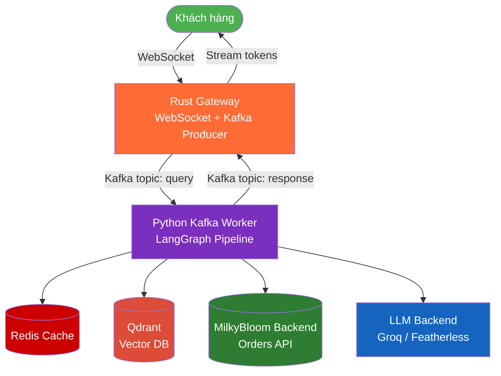
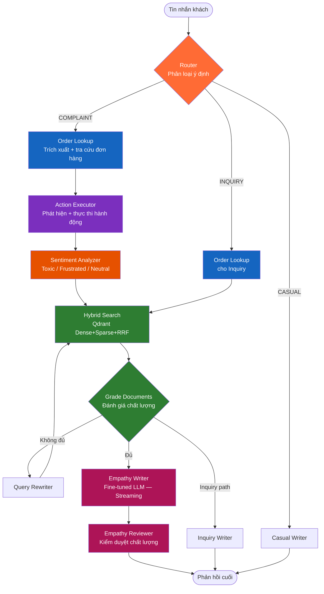
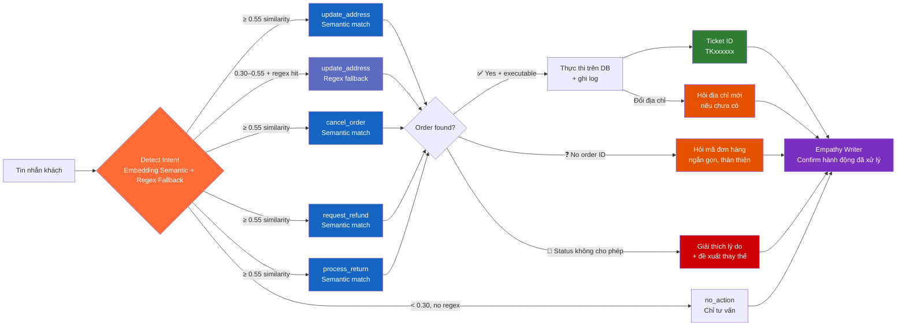

> Integrated overview for the whole product is now in the repo root README: [MilkyBloom x EmpathAI](../README.md)

<div align="center">
  

  # 🧠 EmpathAI

  ### Agentic Customer Service AI — RAG + Action Execution + Emotion Intelligence

  [](https://www.python.org/)
  [](https://www.rust-lang.org/)
  [](https://www.docker.com/)
  [](https://github.com/langchain-ai/langgraph)
  [](https://github.com/)

  **EmpathAI** là hệ thống AI Chăm sóc khách hàng (CSKH) tiếng Việt thế hệ mới — không chỉ **lắng nghe** và **thấu cảm**, mà còn **tự động tra cứu đơn hàng** và **thực thi hành động** (đổi địa chỉ, hủy đơn, hoàn tiền, đổi trả) ngay trong cuộc hội thoại.
</div>

---

## 📖 Tổng quan

EmpathAI kết hợp ba năng lực cốt lõi:

| Năng lực | Mô tả |
|:---|:---|
| **🧠 Thấu cảm** | Fine-tuned LLM phản hồi bằng ngôn từ xoa dịu, không rập khuôn |
| **📚 RAG** | Hybrid Search (Dense + Sparse + RRF) trên chính sách — tự sửa truy vấn nếu kết quả kém |
| **⚙️ Agentic Actions** | Tra cứu đơn hàng thực, phát hiện ý định và **thực thi hành động** ngay lập tức |

> Chat UI của dự án hiện chạy theo mô hình **streaming only**. Các endpoint HTTP chat cũ chỉ còn dùng nội bộ cho snapshot/diagnostics.

---

## 🔄 Kiến trúc tổng thể



---

## 🔀 LangGraph Pipeline Chi Tiết



---

## ⚙️ Action Executor — Agentic Tool Use

Trái tim của kiến trúc agentic. Sau khi tra cứu đơn, AI **tự động phát hiện ý định** và **thực thi hành động** mà không cần nhân viên can thiệp:



### Bảng kịch bản hoạt động

| Tin nhắn khách | Phát hiện | Điều kiện | Kết quả |
|:---|:---|:---|:---|
| `"đặt nhầm địa chỉ, địa chỉ đúng là 45 Nguyễn Trãi Q.1"` + đơn đang ship | Semantic / Regex | Địa chỉ mới có trong tin + backend cho phép | ✅ Gọi API cập nhật địa chỉ |
| `"muốn đổi địa chỉ"` (không nói địa chỉ mới) | Semantic ≥ 0.55 | Thiếu địa chỉ mới | ❓ AI hỏi lại địa chỉ mới |
| `"chỉnh sửa nơi nhận hàng giúp mình"` | Semantic ≥ 0.55 | Không có mã đơn | ❓ AI hỏi mã đơn hàng |
| `"hủy đơn <mã đơn>"` | Regex / Semantic | Đơn đang processing + backend cho phép | ✅ Gọi API hủy đơn |
| `"hủy đơn <mã đơn>"` | Regex / Semantic | Đơn đang ship | 🚫 Báo không thể hủy trên backend |
| `"đơn <mã đơn> lỗi, đổi trả"` | Regex / Semantic | Backend chưa có endpoint đổi trả chatbot | 🚫 Không tạo dữ liệu giả, hướng dẫn kênh hỗ trợ hiện có |
| `"đơn <mã đơn> hỏng, hoàn tiền"` | Regex / Semantic | Backend chưa có endpoint hoàn tiền chatbot | 🚫 Không tạo dữ liệu giả, hướng dẫn kênh hỗ trợ hiện có |

---

## 🏗️ Stack Công nghệ

| Lớp | Công nghệ | Vai trò |
|:---|:---|:---|
| **Gateway** | **Rust (Axum + Tokio)** | WebSocket server, Kafka producer/consumer, HTTP API |
| **Message Queue** | **Redpanda (Kafka-compatible)** | Tách biệt gateway và AI worker, hỗ trợ streaming |
| **AI Pipeline** | **LangGraph (Python)** | Điều phối stateful multi-node workflow |
| **LLM Backends** | **Groq**, **Featherless** | Groq mặc định, Featherless fallback |
| **Embedding** | **BGE-M3** | Dense embedding đa ngôn ngữ |
| **Vector DB** | **Qdrant** | Hybrid Search: Dense + Sparse + RRF fusion |
| **Reranker** | **BGE-Reranker-v2-M3** | Cross-encoder reranking |
| **Cache** | **Redis (Upstash)** | Cache câu trả lời để giảm latency |
| **Observability** | **Langfuse** | Tracing từng node trong LangGraph |
| **Infrastructure** | **Docker Compose** | Qdrant + Redpanda |

---

## ✨ Điểm nổi bật

- ⚙️ **Agentic Action Execution**: AI không chỉ tư vấn mà **tự thực thi** đổi địa chỉ, hủy đơn, hoàn tiền, đổi trả. Phát hiện ý định bằng **semantic embedding** (BGE-M3) + regex fallback — hiểu cả cách diễn đạt tự nhiên, không phụ thuộc từ khóa cứng nhắc.
- 🔍 **Self-Reflective RAG**: Hybrid Search trên Qdrant, tự động rewrite truy vấn nếu tài liệu không đạt chất lượng.
- 🎭 **Empathy-First LLM**: Fine-tuned trên dữ liệu CSKH thực, phân biệt văn phong thấu cảm vs. rập khuôn.
- 🛡️ **Quality Reviewer**: Agent độc lập kiểm duyệt lần cuối — đảm bảo không có câu trả lời "robot".
- ⚡ **Streaming Real-time**: Token streaming qua WebSocket, cảm giác AI đang "gõ phím" cho khách.
- 📊 **Agent Trace UI**: Giao diện hiển thị từng bước pipeline (Router → Order Lookup → Action → Sentiment → RAG → Write).

---

## 🚀 Hướng dẫn chạy

### 1. Cài đặt Dependencies

```bash
cd python && pip install -r requirements.txt
```

### 2. Cấu hình `.env`

```env
# LLM Backend
EMPATHY_MODE=groq               # mặc định: Groq, fallback sang Featherless khi cần
GROQ_API_KEY=your-groq-key
GROQ_BASE_URL=https://api.groq.com/openai/v1
FEATHERLESS_API_KEY=your-featherless-key

# Qdrant
QDRANT_HOST=localhost
QDRANT_PORT=6333

# Redis Cache (Upstash)
UPSTASH_REDIS_REST_URL=your-url
UPSTASH_REDIS_REST_TOKEN=your-token

# Observability
LANGFUSE_PUBLIC_KEY=your-key
LANGFUSE_SECRET_KEY=your-key
```

### 3. Khởi động

```bash
# Terminal 1 — Hạ tầng
docker-compose up -d qdrant redpanda

# Terminal 2 — Python AI Worker
cd python && python -m kafka_workers.query_worker

# Terminal 3 — Rust WebSocket Gateway
cd rust_backend && cargo run
```

Mở trình duyệt: **`http://127.0.0.1:8085`**

### 4. Test nhanh (không cần Docker)

```bash
cd python

# Test order tool (không cần API key)
python test_agent.py l1

# Test full pipeline (ưu tiên GROQ_API_KEY; Featherless là fallback / mode thay thế)
python test_agent.py l2
```

---

## 📁 Cấu trúc thư mục

```
empathai/
├── frontend/                   # UI: HTML + Tailwind + Material Symbols
│   ├── index.html
│   └── app.js                  # WebSocket client + Agent Trace modal
│
├── rust_backend/               # Gateway: WebSocket + Kafka + REST
│
├── python/                     # EmpathAI Core
│   ├── agents/
│   │   ├── graph.py            # LangGraph pipeline (main orchestrator)
│   │   ├── state.py            # AgentState TypedDict
│   │   ├── router.py           # Intent classification
│   │   ├── sentiment_analyzer.py
│   │   ├── empathy_writer.py   # LLM response generation (streaming)
│   │   ├── reviewer.py         # Empathy quality checker
│   │   ├── grader.py           # Document relevance grader
│   │   └── rewriter.py         # Query rewriter
│   ├── tools/
│   │   ├── order_tool.py       # Extract order ID + lookup backend Orders API
│   │   └── action_tool.py      # Detect intent + execute actions
│   ├── retrieval/              # Hybrid Search + Reranker
│   ├── indexing/               # Query engine (Qdrant interface)
│   ├── kafka_workers/          # Kafka consumer (query_worker.py)
│   └── utils/
│
├── data/
│   └── mykingdom_policies.json # Chính sách RAG source
├── docker-compose.yml
└── .env
```

---

## 📈 Observability

Mỗi request được trace đầy đủ qua **Langfuse**:
- Thời gian từng node (Router, Order Lookup, Action Executor, RAG, Writer...)
- Tài liệu chính sách được retrieved
- Sentiment detected + compensation extracted
- Action được thực thi + kết quả

Giao diện Agent Trace trực tiếp trên UI (nút `account_tree` sau mỗi phản hồi).

---

<div align="center">
  <sub>Built with ❤️ — Python · Rust · LangGraph · Qdrant · Groq · Featherless</sub>
</div>
